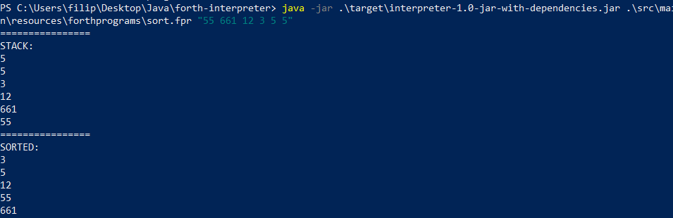

# forth-interpreter
A text app which interprets code written in selected parts of Forth language (fundamentals like loops, if clauses, variable declaration etc.) and outputs the result. 
Based on [this forth implementation](https://skilldrick.github.io/easyforth/). 
Code generation was made with Antlr4. Project done solo.

## compile & run
`mvn clean package`

`java -jar target/interpreter-1.0-jar-with-dependencies.jar`

Without additional arguments program runs in shell mode. You can supply up to 2 additional arguments with the
first one being path to forth script and second being input data. For example:

`java... .jar "src/main/resources/forthprograms/sort.fpr" "55 661 12 3 5 5"` 

## screenshots
Shell:

Script:
